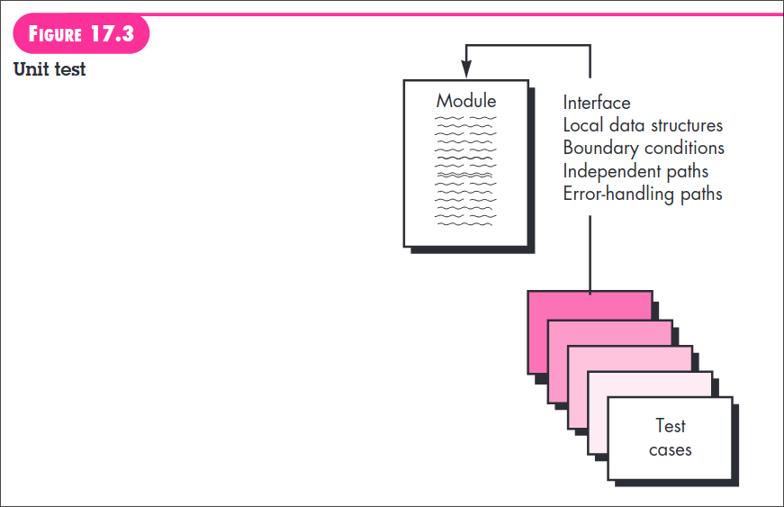
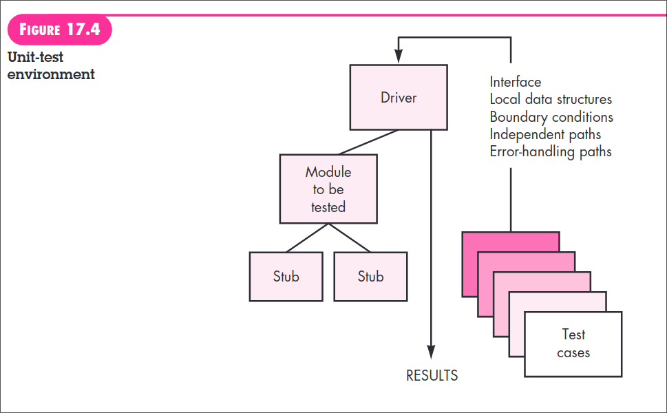
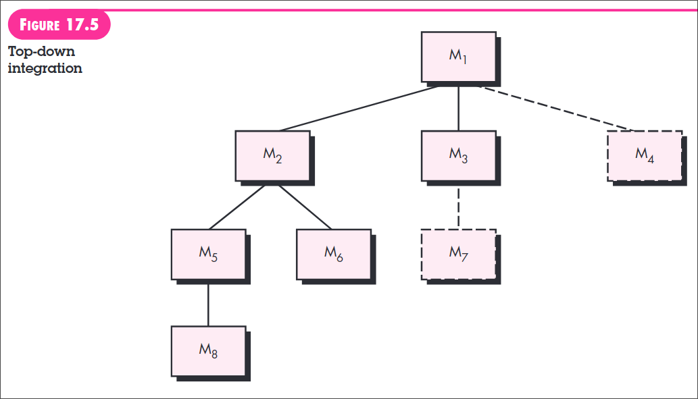
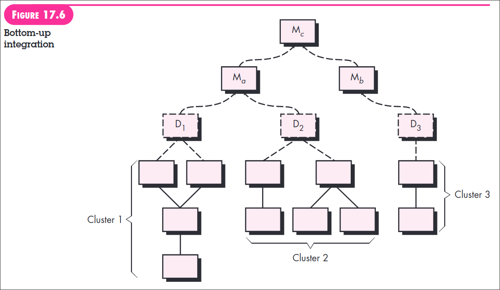

---
markmap:
  maxWidth: 500
  embedAssets: true
  expandlevel: 0
  initialExpandLevel: 0
---
# Software Testing

- Testing is a set of activities that can be planned in advance and conducted systematically. For this reason a template for software testing—a set of steps into which you can place specific test case design techniques and testing methods—should be defined for the software process.  A number of software testing strategies have been proposed in the literature.  
 
- All provide you with a template for testing and all have the following generic characteristics:

    - To perform effective testing, you should conduct effective technical reviews (Chapter 15). By doing this, many errors will be eliminated before testing commences.
    
    - Testing begins at the component level and works “outward” toward the integration of the entire computer-based system.
    
    - Different testing techniques are appropriate for different software engineering approaches and at different points in time.
    
    - Testing is conducted by the developer of the software and (for large projects) an independent test group.
    
    - Testing and debugging are different activities, but debugging must be accommodated in any testing strategy.

A strategy for software testing must accommodate low-level tests that are necessary to verify that a small source code segment has been correctly implemented as well as high-level tests that validate major system functions against customer requirements. A strategy should provide guidance for the practitioner and a set of milestones for the manager. Because the steps of the test strategy occur at a time when deadline pressure begins to rise, progress must be measurable and problems should surface as early as possible.

## Verificaiton and Validation

- Software testing is one element of a broader topic that is often referred to as verification and validation (V&V). Verification refers to the set of tasks that ensure that software correctly implements a specific function. Validation refers to a different set of tasks that ensure that the software that has been built is traceable to customer requirements. Boehm [Boe81] states this another way:

- Verification: “Are we building the product right?”
- Validation: “Are we building the right product?”

The definition of V&V encompasses many software quality assurance activities (Chapter 16). 1 

#### Verification and validation includes a wide array of SQA activities: 
- technical reviews
- quality and configuration audits
- performance monitoring
- simulation
- feasibility study
- documentation review
- database review
- algorithm analysis
- development testing
- usability testing
- qualification testing
- acceptance testing
- and installation testing. 
 
Although testing plays an extremely important role in V&V, many other activities are also necessary.  Testing does provide the last bastion from which quality can be assessed and, more pragmatically, errors can be uncovered. But testing should not be viewed as a safety net. As they say, “You can’t test in quality. If it’s not there before you begin testing, it won’t be there when you’re finished testing.” Quality is incorporated into software throughout the process of software engineering. Proper application of methods and tools, effective technical reviews, and solid management and measurement all lead to quality that is confirmed during testing.  Miller [Mil77] relates software testing to quality assurance by stating that “the underlying motivation of program testing is to affirm software quality with methods that can be economically and effectively applied to both large-scale and small-scale systems.”

## Unit Testing

Unit testing focuses verification effort on the smallest unit of software design—the software component or module. Using the component-level design description as a guide, important control paths are tested to uncover errors within the boundary of the module. The relative complexity of tests and the errors those tests uncover is limited by the constrained scope established for unit testing. The unit test focuses on the internal processing logic and data structures within the boundaries of a component.  This type of testing can be conducted in parallel for multiple components.

### Unit-test considerations

Unit tests are illustrated schematically in Figure 17.3.  

- The module interface is tested to ensure that information properly flows into and out of the program unit under test. Local data structures are examined to ensure that data stored temporarily maintains its integrity during all steps in an algorithm’s execution. All independent paths through the control structure are exercised to ensure that all statements in a module have been executed at least once. Boundary conditions are tested to ensure that the module operates properly at boundaries established to limit or restrict processing. And finally, all error-handling paths are tested.  Data flow across a component interface is tested before any other testing is initiated. If data do not enter and exit properly, all other tests are moot. In addition, local data structures should be exercised and the local impact on global data should be ascertained (if possible) during unit testing.  Selective testing of execution paths is an essential task during the unit test. Test cases should be designed to uncover errors due to erroneous computations, incorrect comparisons, or improper control flow.  Boundary testing is one of the most important unit testing tasks. Software often fails at its boundaries. That is, errors often occur when the nth element of an n-dimensional array is processed, when the ith repetition of a loop with i passes is invoked, when the maximum or minimum allowable value is encountered. Test cases that exercise data structure, control flow, and data values just below, at, and just above maxima and minima are very likely to uncover errors.

A good design anticipates error conditions and establishes error-handling paths to reroute or cleanly terminate processing when an error does occur. Yourdon [You75] calls this approach antibugging. Unfortunately, there is a tendency to incorporate error handling into software and then never test it. A true story may serve to illustrate: A computer-aided design system was developed under contract. In one transaction processing module, a practical joker placed the following error handling message after a series of conditional tests that invoked various control flow branches: ERROR! THERE IS NO WAY YOU CAN GET HERE. This “error message” was uncovered by a customer during user training!  

#### Among the potential errors that should be tested when error handling is evaluated are: 
  1) error description is unintelligible, 
  2) error noted does not correspond to error encountered, 
  3) error condition causes system intervention prior to error handling, 
  4) exception-condition processing is incorrect, or 
  5) error description does not provide enough information to assist in the location of the cause of the error.

### Unit-test Procedures

- Unit testing is normally considered as an adjunct to the coding step. The design of unit tests can occur before coding begins or after source code has been generated. A review of design information provides guidance for establishing test cases that are likely to uncover errors in each of the categories discussed earlier. Each test case should be coupled with a set of expected results.  Because a component is not a stand-alone program, driver and/or stub software must often be developed for each unit test. The unit test environment is illustrated in Figure 17.4. 

In most applications a driver is nothing more than a “main program” that accepts test case data, passes such data to the component (to be tested), and prints relevant results. Stubs serve to replace modules that are subordinate (invoked by) the component to be tested. A stub or “dummy subprogram” uses the subordinate module’s interface, may do minimal data manipulation, prints verification of entry, and returns control to the module undergoing testing.  Drivers and stubs represent testing “overhead.” That is, both are software that must be written (formal design is not commonly applied) but that is not delivered with the final software product. If drivers and stubs are kept simple, actual overhead is relatively low. Unfortunately, many components cannot be adequately unit tested with “simple” overhead software. In such cases, complete testing can be postponed until the integration test step (where drivers or stubs are also used).  Unit testing is simplified when a component with high cohesion is designed.  When only one function is addressed by a component, the number of test cases is reduced and errors can be more easily predicted and uncovered.

## Integration Testing

- A neophyte in the software world might ask a seemingly legitimate question once all modules have been unit tested: “If they all work individually, why do you doubt that they’ll work when we put them together?” The problem, of course, is “putting them together”—interfacing. Data can be lost across an interface; one component can have an inadvertent, adverse effect on another; subfunctions, when combined, may not produce the desired major function; individually acceptable imprecision may be magnified to unacceptable levels; global data structures can present problems.  Sadly, the list goes on and on.  Integration testing is a systematic technique for constructing the software architecture while at the same time conducting tests to uncover errors associated with interfacing. The objective is to take unit-tested components and build a program structure that has been dictated by design.  There is often a tendency to attempt nonincremental integration; that is, to construct the program using a “big bang” approach. All components are combined in advance. The entire program is tested as a whole. And chaos usually results! A set of errors is encountered. Correction is difficult because isolation of causes is complicated by the vast expanse of the entire program. Once these errors are corrected, new ones appear and the process continues in a seemingly endless loop.  Incremental integration is the antithesis of the big bang approach. The program is constructed and tested in small increments, where errors are easier to isolate and correct; interfaces are more likely to be tested completely; and a systematic test approach may be applied. In the paragraphs that follow, a number of different incremental integration strategies are discussed.

### Top-down Integration

- Top-down integration testing is an incremental approach to construction of the software architecture. Modules are integrated by moving downward through the control hierarchy, beginning with the main control module (main program). Modules subordinate (and ultimately subordinate) to the main control module are incorporated into the structure in either a depth-first or breadth-first manner.

Referring to Figure 17.5, depth-first integration integrates all components on a major control path of the program structure. Selection of a major path is somewhat arbitrary and depends on application-specific characteristics. For example, selecting the left-hand path, components M1 , M2 , M5 would be integrated first. Next, M8 or (if necessary for proper functioning of M2 ) M6 would be integrated. Then, the central and right-hand control paths are built. Breadth-first integration incorporates all components directly subordinate at each level, moving across the structure horizontally.  From the figure, components M 2 , M 3 , and M4 would be integrated first. The next control level, M5 , M 6 , and so on, follows. 

#### The integration process is performed in a series of five steps:

1. The main control module is used as a test driver and stubs are substituted for all components directly subordinate to the main control module.

2. Depending on the integration approach selected (i.e., depth or breadth first), subordinate stubs are replaced one at a time with actual components.

3. Tests are conducted as each component is integrated.

4. On completion of each set of tests, another stub is replaced with the real component.

5. Regression testing (discussed later in this section) may be conducted to ensure that new errors have not been introduced.  The process continues from step 2 until the entire program structure is built.

The top-down integration strategy verifies major control or decision points early in the test process. In a “well-factored” program structure, decision making occurs at upper levels in the hierarchy and is therefore encountered first. If major control problems do exist, early recognition is essential. If depth-first integration is selected, a complete function of the software may be implemented and demonstrated. Early demonstration of functional capability is a confidence builder for all stakeholders.  Top-down strategy sounds relatively uncomplicated, but in practice, logistical problems can arise. The most common of these problems occurs when processing at low levels in the hierarchy is required to adequately test upper levels. Stubs replace low-level modules at the beginning of top-down testing; therefore, no significant data can flow upward in the program structure. As a tester, you are left with three choices: (1) delay many tests until stubs are replaced with actual modules, (2) develop stubs that perform limited functions that simulate the actual module, or (3) integrate the software from the bottom of the hierarchy upward.  The first approach (delay tests until stubs are replaced by actual modules) can cause you to lose some control over correspondence between specific tests and incorporation of specific modules. This can lead to difficulty in determining the cause of errors and tends to violate the highly constrained nature of the top-down approach. The second approach is workable but can lead to significant overhead, as stubs become more and more complex. The third approach, called bottom-up integration is discussed in the paragraphs that follow.

### Bottom-Up Integration

- Bottom-up integration testing, as its name implies, begins construction and testing with atomic modules (i.e. components at the lowest levels in the program structure). Because components are integrated from the bottom up, the functionality provided by components subordinate to a given level is always available and the need for stubs is eliminated. 

#### A bottom-up integration strategy may be implemented with the following steps:

1. Low-level components are combined into clusters (sometimes called builds) that perform a specific software subfunction.

2. A driver (a control program for testing) is written to coordinate test case input and output.

3. The cluster is tested.

4. Drivers are removed and clusters are combined moving upward in the program structure.

 
Integration follows the pattern illustrated in Figure 17.6. Components are combined to form clusters 1, 2, and 3. Each of the clusters is tested using a driver (shown as a dashed block). Components in clusters 1 and 2 are subordinate to Ma. Drivers D 1 and D 2 are removed and the clusters are interfaced directly to Ma. Similarly, driver D3 for cluster 3 is removed prior to integration with module Mb. Both Ma and Mb will ultimately be integrated with component Mc, and so forth.

As integration moves upward, the need for separate test drivers lessens. In fact, if the top two levels of program structure are integrated top down, the number of drivers can be reduced substantially and integration of clusters is greatly simplified.

## Regression Testing

- Each time a new module is added as part of integration testing, the software changes. New data flow paths are established, new I/O may occur, and new control logic is invoked. These changes may cause problems with functions that previously worked flawlessly. In the context of an integration test strategy, regression testing is the reexecution of some subset of tests that have already been conducted to ensure that changes have not propagated unintended side effects.  In a broader context, successful tests (of any kind) result in the discovery of errors, and errors must be corrected. Whenever software is corrected, some aspect of the software configuration (the program, its documentation, or the data that support it) is changed. Regression testing helps to ensure that changes (due to testing or for other reasons) do not introduce unintended behavior or additional errors.  Regression testing may be conducted manually, by reexecuting a subset of all test cases or using automated capture/playback tools. Capture/playback tools enable the software engineer to capture test cases and results for subsequent playback and comparison. 
 
#### The regression test suite (the subset of tests to be executed) contains three different classes of test cases:

- A representative sample of tests that will exercise all software functions.

- Additional tests that focus on software functions that are likely to be affected by the change.

- Tests that focus on the software components that have been changed.

As integration testing proceeds, the number of regression tests can grow quite large. Therefore, the regression test suite should be designed to include only those tests that address one or more classes of errors in each of the major program functions. It is impractical and inefficient to reexecute every test for every program function once a change has occurred.

## Alpha-Beta Testing

- It is virtually impossible for a software developer to foresee how the customer will really use a program. Instructions for use may be misinterpreted; strange combinations of data may be regularly used; output that seemed clear to the tester may be unintelligible to a user in the field.  When custom software is built for one customer, a series of acceptance tests are conducted to enable the customer to validate all requirements. Conducted by the end user rather than software engineers, an acceptance test can range from an informal “test drive” to a planned and systematically executed series of tests. In fact, acceptance testing can be conducted over a period of weeks or months, thereby uncovering cumulative errors that might degrade the system over time.If software is developed as a product to be used by many customers, it is impractical to perform formal acceptance tests with each one. Most software product builders use a process called alpha and beta testing to uncover errors that only the end user seems able to find.  

- The alpha test is conducted at the developer’s site by a representative group of end users. The software is used in a natural setting with the developer “looking over the shoulder” of the users and recording errors and usage problems. Alpha tests are conducted in a controlled environment.  
 
- The beta test is conducted at one or more end-user sites. Unlike alpha testing, the developer generally is not present. Therefore, the beta test is a “live” application of the software in an environment that cannot be controlled by the developer. The customer records all problems (real or imagined) that are encountered during beta testing and reports these to the developer at regular intervals. As a result of problems reported during beta tests, you make modifications and then prepare for release of the software product to the entire customer base.  
 
- A variation on beta testing, called customer acceptance testing, is sometimes performed when custom software is delivered to a customer under contract. The customer performs a series of specific tests in an attempt to uncover errors before accepting the software from the developer. In some cases (e.g., a major corporate or governmental system) acceptance testing can be very formal and encompass many days or even weeks of testing.

## Stress Testing

- Earlier software testing steps resulted in thorough evaluation of normal program functions and performance. Stress tests are designed to confront programs with abnormal situations. In essence, the tester who performs stress testing asks: “How high can we crank this up before it fails?” Stress testing executes a system in a manner that demands resources in abnormal quantity, frequency, or volume. For example, (1) special tests may be designed that generate ten interrupts per second, when one or two is the average rate, (2) input data rates may be increased by an order of magnitude to determine how input functions will respond, (3) test cases that require maximum memory or other resources are executed, (4) test cases that may cause thrashing in a virtual operating system are designed, (5) test cases that may cause excessive hunting for disk-resident data are created. Essentially, the tester attempts to break the program.  A variation of stress testing is a technique called sensitivity testing. In some situations (the most common occur in mathematical algorithms), a very small range of data contained within the bounds of valid data for a program may cause extreme and even erroneous processing or profound performance degradation. Sensitivity testing attempts to uncover data combinations within valid input classes that may cause instability or improper processing.

## Performance Testing

- For real-time and embedded systems, software that provides required function but does not conform to performance requirements is unacceptable. Performance testing is designed to test the run-time performance of software within the context of an integrated system. Performance testing occurs throughout all steps in the testing process. Even at the unit level, the performance of an individual module may be assessed as tests are conducted. However, it is not until all system elements are fully integrated that the true performance of a system can be ascertained.  Performance tests are often coupled with stress testing and usually require both hardware and software instrumentation. That is, it is often necessary to measure resource utilization (e.g., processor cycles) in an exacting fashion. External instrumentation can monitor execution intervals, log events (e.g., interrupts) as they occur, and sample machine states on a regular basis. By instrumenting a system, the tester can uncover situations that lead to degradation and possible system failure.

## White-Box Testing

- White-box testing, sometimes called glass-box testing, is a test-case design philosophy that uses the control structure described as part of component-level design to derive test cases. 
 
#### Using white-box testing methods, you can derive test cases that

1) guarantee that all independent paths within a module have been exercised at least once, 

2) exercise all logical decisions on their true and false sides, 

3) execute all loops at their boundaries and within their operational bounds,

4) and exercise internal data structures to ensure their validity.

## Baisis Path Testing

- Basis path testing is a **white-box testing technique** first proposed by Tom McCabe [McC76]. The basis path method enables the test-case designer to derive a logical complexity measure of a procedural design and use this measure as a guide for defining a basis set of execution paths. Test cases derived to exercise the basis set are guaranteed to execute every statement in the program at least one time during testing.

## Black-Box Testing

- Black-box testing, also called behavioral testing, focuses on the functional requirements of the software. That is, black-box testing techniques enable you to derive sets of input conditions that will fully exercise all functional requirements for a program.  Black-box testing is not an alternative to white-box techniques. Rather, it is a complementary approach that is likely to uncover a different class of errors than whitebox methods.  
 
#### Black-box testing attempts to find errors in the following categories: 

1) incorrect or missing functions, 
2) interface errors, 
3) errors in data structures or external database access, 
4) behavior or performance errors, and 
5) initialization and termination errors.  

Unlike white-box testing, which is performed early in the testing process, blackbox testing tends to be applied during later stages of testing (see Chapter 17). Because black-box testing purposely disregards control structure, attention is focused on the information domain. 

#### Tests are designed to answer the following questions:

- How is functional validity tested?
- How are system behavior and performance tested?
- What classes of input will make good test cases?
- Is the system particularly sensitive to certain input values?
- How are the boundaries of a data class isolated?
- What data rates and data volume can the system tolerate?
- What effect will specific combinations of data have on system operation?
 
By applying black-box techniques, you derive a set of test cases that satisfy the following criteria [Mye79]: (1) test cases that reduce, by a count that is greater than one, the number of additional test cases that must be designed to achieve reasonable testing, and (2) test cases that tell you something about the presence or absence of classes of errors, rather than an error associated only with the specific test at hand.
