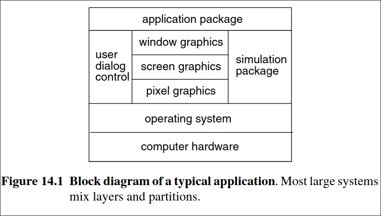
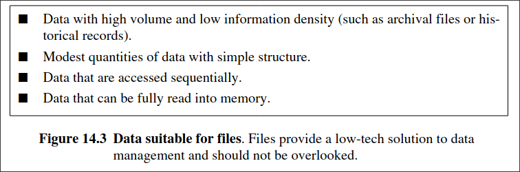
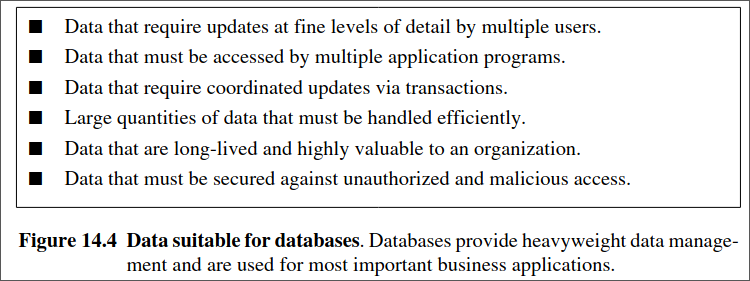

---
markmap:
  maxWidth: 500
  embedAssets: true
  expandlevel: 0
  initialExpandLevel: 0
---

# Overview of System Design

During analysis, the focus is on what needs to be done, independent of how it is done. During design, developers make decisions about how the problem will be solved, first at a high level and then with more detail.  

- **System design** is the first design stage for devising the basic approach to solving the problem. During system design, developers decide the overall structure and style. The sys- tem architecture determines the organization of the system into subsystems. In addition, the architecture provides the context for the detailed decisions that are made in later stages. 

- You must make the following decisions.
 
    - Estimate system performance. [14.2]
     
    - Make a reuse plan. [14.3]
     
    - Organize the system into subsystems. [14.4]
     
    - Identify concurrency inherent in the problem. [14.5]
     
    - Allocate subsystems to hardware. [14.6]
     
    - Manage data stores. [14.7]
     
    - Handle global resources. [14.8]
     
    - Choose a software control strategy. [14.9]
     
    - Handle boundary conditions. [14.10]
     
    - Set trade-off priorities. [14.11]
     
    - Select an architectural style. [14.12]
 
You can often choose the architecture of a system by analogy to previous systems. Certain kinds of architecture pertain to broad classes of problems. Section 14.12 surveys several common architectures and describes their corresponding problems. Not all problems can be solved by one of these architectures, but many can. You can construct additional architec- tures by combining these forms.

## Estimating Performance

- Early in the planning for a new system you should prepare a rough performance estimate.  Engineers call this a “back of the envelope” calculation. The purpose is not to achieve high accuracy, but merely to determine if the system is feasible. Getting within a factor of two is usually sufficient, although what you can achieve depends on the problem. The calculation should be fast and involve common sense. You will have to make simplifying assumptions.  Don’t worry about details—just approximate, estimate, and guess, if necessary.  
 
- ATM example. 
  - Suppose we are planning an ATM network for a bank. We might pro- ceed as follows. The bank has 40 branches. Suppose there are an equal number of terminals in supermarkets and other stores. Suppose on a busy day half the terminals are busy at once.  (We could assume all of the terminals are busy without changing the results much. The point is to establish reasonable performance limits.) Suppose that each customer takes one minute to perform a session, and that most transactions involve a single deposit or withdrawal. So we estimate a peak requirement of about 40 transactions a minute, or about one per second.  This may not be precise, but it shows that we do not require unusually fast computer hard- ware. The situation would be much different if we were estimating for an online bookseller or stockbroker, in which case the computer hardware would become a big issue.  You can perform similar estimates for data storage. Count the number of customers, es- timate the amount of data for each one, and multiply. In the case of a bank, the requirements for data storage are more severe than for ATM computing power, but they are hardly enor- mous. Again, the situation would be different for a satellite-based ground imaging system, in which both data storage and access bandwidth would be key architectural issues.

## Making a Reuse Plan

- Reuse is often cited as an advantage of OO technology, but reuse does not happen automat- ically. There are two very different aspects of reuse—using existing things and creating re- usable new things. It is much easier to reuse existing things than to design new things for uncertain uses to come. Of course, someone must have designed things in the past in order for us to reuse them now. The point is that most developers reuse existing things, and only a small fraction of developers create new things. Don’t feel that you should start with OO tech- nology by building reusable things—that takes a great deal of experience.  Reusable things include models, libraries, frameworks, and patterns. Reuse of models is often the most practical form of reuse. The logic in a model can apply to multiple problems.

### Libraries

- A library is a collection of classes that are useful in many contexts. The collection of classes must be carefully organized, so that users can find them. Good organization takes a lot of work, and it can be difficult to decide where to place everything. Online searching can help, but is no substitute for careful organization. In addition, the classes must have accurate and thorough descriptions to help users determine their relevance. [Korson-92] notes several qualities of “good” class libraries.

 - Coherence. 
   - A class library should be organized about a few, well-focused themes.
 
 - Completeness. 
   - A class library should provide complete behavior for the chosen themes.
 
 - Consistency. 
   - Polymorphic operations should have consistent names and signatures across classes.
 
 - Efficiency. 
   - A library should provide alternative implementations of algorithms (such as various sort algorithms) that trade time and space.
 
 - Extensibility. 
   - The user should be able to define subclasses for library classes.
 
 - Genericity. 
   - A library should use parameterized class definitions where appropriate.  Unfortunately, problems can arise when integrating class libraries from multiple sources, as shown below [Berlin-90]. Developers often disperse pragmatic decisions across classes and inheritance hierarchies. Class libraries may adopt policies that are individually sensible, but fundamentally incompatible with those of other class libraries. You cannot fix such pragmat- ic inconsistencies by specializing a class or adding code. Instead, you must break encapsu- lation and rework the source code. These problems are so severe that they will effectively limit your ability to reuse code from class libraries.

 - Argument validation. 
   - An application may validate arguments as a collection or indi- vidually as entered. Collective validation is appropriate for command interfaces; the user enters all arguments, and only then are they checked. In contrast, responsive user interfaces validate each argument or interdependent group of arguments as it is entered.  A combination of class libraries, some that validate by collection and others that vali- date by individual, would yield an awkward user interface.

 - Error handling. 
   - Class libraries use different error-handling techniques. Methods in one library may return error codes to the calling routine, for example, while methods in an- other library may directly deal with errors.
 
 - Control paradigms. 
   - Applications may adopt event-driven or procedure-driven control.  With event-driven control the user interface invokes application methods. With proce- dure-driven control the application calls user interface methods. It is difficult to com- bine both kinds of user interface within an application.
 
 - Group operations. 
   - Group operations are often inefficient and incomplete. For exam- ple, an object-delete primitive may acquire database locks, make the deletion, and then commit the transaction. If you want to delete a group of objects as a transaction, the class library must have a group-delete function.
 
 - Garbage collection. 
   - Class libraries use different strategies to manage memory alloca- tion and avoid memory leaks. A library may manage memory for strings by returning a pointer to the actual string, returning a copy of the string, or returning a pointer with read-only access. Garbage collection strategies may also differ: mark and sweep, refer- ence counting, or letting the application handle garbage collection (in C++, for exam- ple).
 
 - Name collisions. 
   - Class names, public attributes, and public methods lie within a global name space, so you must hope they do not collide for different class libraries. Most class libraries add a distinguishing prefix to names to reduce the likelihood of collisions.

### Frameworks

- A framework [Johnson-88] is a skeletal structure of a program that must be elaborated to build a complete application. This elaboration often consists of specializing abstract classes with behavior specific to an individual application. A class library may accompany a frame- work, so that the user can perform much of the specialization by choosing the appropriate subclasses rather than programming subclass behavior from scratch. Frameworks consist of more than just the classes involved and include a paradigm for flow of control and shared invariants. Frameworks tend to be specific to a category of applications; framework class li- braries are typically application specific and not suitable for general use.

### Patterns

- A pattern is a proven solution to a general problem. Various patterns target different phases of the software development lifecycle. There are patterns for analysis, architecture, design, and implementation. You can achieve reuse by using existing patterns, rather than reinvent- ing solutions from scratch. A pattern comes with guidelines on when to use it, as well as trade-offs on its use.  There are many benefits of patterns. One advantage is that a pattern has been carefully considered by others and has already been applied to past problems. Consequently, a pattern is more likely to be correct and robust than an untested, custom solution. Also when you use patterns, you tap into a language that is familiar to many developers. A body of literature is available that documents patterns, explaining their subtleties and nuances. You can regard patterns as extending a modeling language—you need not think only in terms of primitives; you can also think in terms of recurring combinations. Patterns are prototypical model frag- ments that distill some of the knowledge of experts.  A pattern is different from a framework. A pattern is typically a small number of classes and relationships. In contrast, a framework is much broader in scope (typically at least an order of magnitude larger) and covers an entire subsystem or application.  ATM example. The notion of a transaction offers some possibility of reuse—transac- tions are a frequent occurrence in computer systems, and there is commercial software to support them. There may also be an opportunity for reuse with the communications infrastructure that connects the consortium to ATMs and bank computers.

## Breaking Systems info Subsystem

- For all but the smallest applications, the first step in system design is to divide the system into pieces. Each major piece of a system is called a subsystem. Each subsystem is based on some common theme, such as similar functionality, the same physical location, or execution on the same kind of hardware. For example, a spaceship computer might include subsystems for life support, navigation, engine control, and running scientific experiments.  A subsystem is not an object nor a function but a group of classes, associations, opera- tions, events, and constraints that are interrelated and have a well-defined and (hopefully) small interface with other subsystems. A subsystem is usually identified by the services it provides. A service is a group of related functions that share some common purpose, such as processing I/O, drawing pictures, or performing arithmetic. A subsystem defines a coherent way of looking at part of the problem. For example, the file system within an operating sys- tem is a subsystem; it comprises a set of related abstractions that are largely independent of abstractions in other subsystems, such as memory management and process control.  Each subsystem has a well-defined interface to the rest of the system. The interface spec- ifies the form of all interactions and the information flow across subsystem boundaries but does not specify how the subsystem is implemented internally. Each subsystem can then be designed independently without affecting the others.  You should define subsystems so that most interactions are internal, rather than across subsystem boundaries. This reduces the dependencies among subsystems. A system should be divided into a small number of subsystems; 20 is probably too many. Each subsystem may in turn be decomposed into smaller subsystems of its own.  The relationship between two subsystems can be client-server or peer-to-peer. In a cli- ent-server relationship, the client calls on the server, which performs some service and re- plies with a result. The client must know the server’s interface, but the server need not know its clients’ interfaces because clients initiate all interactions.  In a peer-to-peer relationship, each subsystem may call on the others. A communication from one subsystem to another is not necessarily followed by an immediate response. Peer- to-peer interactions are more complicated, because the subsystems must know each other’s interfaces. Communications cycles can occur that are hard to understand and liable to subtle design errors. Look for client-server decompositions whenever possible, because a one-way interaction is much easier to build, understand, and change than a two-way interaction.  The decomposition of systems into subsystems may be organized as a sequence of hor- izontal layers or vertical partitions.

### Layers 

- A layered system is an ordered set of virtual worlds (a set of tiers), each built in terms of the ones below it and providing the implementation basis for the ones above it. The objects in each layer can be independent, although there is often some correspondence between objects in different layers. Knowledge is one-way only—a subsystem knows about the layers below it, but has no knowledge of the layers above it. A client-server relationship exists between upper layers (users of services) and lower layers (providers of services).  In an interactive graphics system, for example, windows are made from screen opera- tions, which are implemented using pixel operations, which execute as device I/O opera- tions. Each layer may have its own set of classes and operations. Each layer is implemented in terms of the classes and operations of lower layers.  Layered architectures come in two forms: closed and open. In a closed architecture, each layer is built only in terms of the immediate lower layer. This reduces the dependencies between layers and allows changes to be made most easily, because a layer’s interface affects only the next layer. In an open architecture, a layer can use features of any lower layer to any depth. This reduces the need to redefine operations at each level, which can result in a more efficient and compact code. However, an open architecture does not observe the prin- ciple of information hiding. Changes to a subsystem can affect any higher subsystem, so an open architecture is less robust than a closed architecture. Both kinds of architectures are useful; the designer must weigh the relative value of efficiency and modularity.  Usually the problem statement specifies only the top and bottom layers: The top is the desired system and the bottom is the available resources (hardware, operating system, exist- ing libraries). If the disparity between the two is too great (as it often is), then you must in- troduce intermediate layers to reduce the conceptual gap between adjoining layers.  You can port a system constructed in layers to other hardware/software platforms by re- writing one layer. It is a good practice to introduce at least one layer of abstraction between the application and any services provided by the operating system or hardware. Define a lay- er of interface classes providing logical services and map them onto the concrete services that are system dependent.

### Partitions

- Partitions vertically divide a system into several independent or weakly coupled sub- systems, each providing one kind of service. For example, a computer operating system in- cludes a file system, process control, virtual memory management, and device control. The subsystems may have some knowledge of each other, but this knowledge is not deep and avoids major design dependencies.

One difference between layers and partitions is that layers vary in their level of abstrac- tion. In contrast, partitions merely divide a system into pieces, all of which have a similar level of abstraction. Another difference is that layers ultimately depend on each other, usu- ally in a client-server relationship through an open or closed architecture. In contrast, parti- tions are peers that are independent or mutually dependent (peer-to-peer relationship).

### Combining Layers and Partitions

- You can decompose a system into subsystems by combining layers and partitions. Layers can be partitioned, and partitions can be layered. Figure 14.1 shows a block diagram of a typ- ical application, which involves simulation and interactive graphics. Most large systems re- quire a mixture of layers and partitions.

Once you have identified the top-level subsystems, you should show their information flow. Sometimes, all subsystems interact with all other subsystems, but often the flow is sim- pler. For example, many computations have the form of a pipeline; a compiler is an example.  Other systems are arranged as a star, in which a master subsystem controls all interactions with other subsystems. Use simple topologies when possible to reduce the number of inter- actions among subsystems.  ATM example. Figure 14.2 shows the architecture of the ATM system. There are three major subsystems: the ATM stations, the consortium computer, and the bank computers. The topology is a simple star; the consortium computer communicates with all the ATM stations and with all the bank computers (comm links). The architecture uses the station code and the bank code to distinguish the phone lines to the consortium computer.

## Identifying Concurrency

- In the analysis model, as in the real world and in hardware, all objects are concurrent. In an implementation, however, not all software objects are concurrent, because one processor may support many objects. In practice, you can implement many objects on a single proces- sor if the objects cannot be active together. One important goal of system design is to identify the objects that must be active concurrently and the objects that have mutually exclusive ac- tivity. You can fold the latter objects onto a single thread of control, or task.

### Identifying Inherent Concurrency

- The state model is the guide to identifying concurrency. Two objects are inherently concur- rent if they can receive events at the same time without interacting. If the events are unsyn- chronized, you cannot fold the objects onto a single thread of control. For example, the engine and the wing controls on an airplane must operate concurrently (if not completely in- dependently). Independent subsystems are desirable, because you can assign them to differ- ent hardware units without any communication cost.  You need not implement two subsystems that are inherently concurrent as separate hard- ware units. The purpose of hardware interrupts, operating systems, and tasking mechanisms is to simulate logical concurrency in a uniprocessor. Separate sensors must, of course, pro- cess physically concurrent input, but if there are no timing constraints on response, then a multitasking operating system can handle the computation. Often the problem statement specifies that distinct hardware units must implement the objects.  ATM example. If the ATM statement from Chapter 11 contained the requirement that each machine should continue to operate locally in the event of a central system failure (per- haps with reduced transaction limits), then we would have no choice but to include a CPU in each ATM machine with a full control program.

### Defining Concurrent Tasks

- Although all objects are conceptually concurrent, in practice many objects in a system are interdependent. By examining the state diagrams of individual objects and the exchange of events among them, you can often fold many objects onto a single thread of control. A thread of control is a path through a set of state diagrams on which only a single object at a time is active. A thread remains within a state diagram until an object sends an event to another ob- ject and waits for another event. The thread passes to the receiver of the event until it even- tually returns to the original object. The thread splits if the object sends an event and continues executing.  On each thread of control, only a single object at a time is active. You can implement threads of control as tasks in computer systems.  ATM example. While the bank is verifying an account or processing a bank transaction, the ATM machine is idle. If a central computer directly controls the ATM, we can combine the ATM object with the bank transaction object as a single task.

## Allocation of Subsystems

- You must allocate each concurrent subsystem to a hardware unit, either a general-purpose processor or a specialized functional unit as follows.

    - Estimate performance needs and the resources needed to satisfy them.

    - Choose hardware or software implementation for subsystems.

    - Allocate software subsystems to processors to satisfy performance needs and minimize interprocessor communication.

    - Determine the connectivity of the physical units that implement the subsystems.

### Estimating Hardware Resource Requirements

- The decision to use multiple processors or hardware functional units is based on a need for higher performance than a single CPU can provide. The number of processors required de- pends on the volume of computations and the speed of the machine. For example, a military radar system generates too much data in too short a time to handle in a single CPU, even a very large one. Many parallel machines must digest the data before analyzing a threat.  The system designer must estimate the required CPU processing power by computing the steady-state load as the product of the number of transactions per second and the time required to process a transaction. The estimate will usually be imprecise. Often some exper- imentation is useful. You should increase the estimate to allow for transient effects, due to random variations in load as well as to synchronized bursts of activity. The amount of excess capacity needed depends on the acceptable rate of failure due to insufficient resources. Both the steady-state load and the peak load are important.  ATM example. The ATM machine itself is relatively simple—all it must do is to pro- vide a user interface and, possibly some local processing. At most a single CPU would suf- fice for each ATM. The consortium computer is essentially just a routing machine—it receives ATM requests and dispatches them to the appropriate bank computer. A large net- work might need to be partitioned in some way and involve multiple CPUs, so that the con- sortium computer does not become a bottleneck. The bank computers perform data processing and involve relatively straightforward database applications. The database ven- dors have single-processor and multiprocessor versions of their products, and the appropriate choice depends on the needed throughput and reliability.

### Making Hardware-Software Trade Offs

- Object orientation provides a good way for thinking about hardware. Each device is an object that operates concurrently with other objects (other devices or software). You must decide which subsystems will be implemented in hardware and which in software. There are two main reasons for implementing subsystems in hardware.

    - Cost. 
      - Existing hardware provides exactly the functionality required. Today it is easier to buy a floating-point chip than to implement floating point in software. Sensors and actuators must be hardware, of course.

    - Performance. 
      - The system requires a higher performance than a general-purpose CPU can provide, and more efficient hardware is available. For example, chips that perform the fast Fourier transform (FFT) are widely used in signal-processing applications.

Much of the difficulty of designing a system comes from meeting externally imposed hard- ware and software constraints. OO design provides no magic solution, but the external pack- ages can be modeled nicely as objects. You must consider compatibility, cost, and performance issues. You should also think about flexibility for future changes, both design changes and future product enhancements. Providing flexibility costs something; the archi- tect must decide how much it is worth. ATM example. There are no pressing performance issues for the ATM application.  Hence general-purpose computers should suffice for the ATMs, consortium, and banks.

### Allocating Tasks to Processors

- The system design must allocate tasks for the various software subsystems to processors.  There are several reasons for assigning tasks to processors.

    - Logistics. 
      - Certain tasks are required at specific physical locations, to control hardware, or to permit independent operation. For example, an engineering workstation needs its own operating system to permit operation when the interprocessor network is down.

    - Communication limits. 
      - The response time or data flow rate exceeds the available com- munication bandwidth between a task and a piece of hardware. For example, high per- formance graphics devices require tightly coupled controllers because of their high in- ternal data generation rates.

    - Computation limits. 
      - Computation rates are too great for a single processor, so several processors must support the tasks. You can minimize communication costs by assigning highly interactive subsystems to the same processor. You should assign independent subsystems to separate processors.

  - ATM example. 
    - The ATM does not have any issues with communication and computation limits. The communication traffic and computation that an ATM user initiates are relatively minor. However, there may be an issue with logistics. If the ATM must have autonomy and operate when the communications network is down, then it must have its own CPU and pro- gramming. Otherwise, if the ATM is just a dumb terminal that accesses the network and per- forms all computation via the network, we can simplify ATM logic.

### Determining Physical Connectivity

- After determining the kinds and relative numbers of physical units, you must determine the arrangement and form of the connections among the physical units.
 
    - Connection topology. 
      - Choose the topology for connecting the physical units. Associa- tions in the class model often correspond to physical connections. Client-server relation- ships also correspond to physical connections. Some connections may be indirect; you should try to minimize the connection cost of important relationships.
    
    - Repeated units. 
      - Choose the topology of repeated units. If you have boosted perfor- mance by including several copies of a particular kind of unit or group of units, you must specify their topology. The class model is not a useful guide, because the use of multiple units is primarily a design optimization not required by analysis. The topology of repeat- ed units usually has a regular pattern, such as a linear sequence, a matrix, a tree, or a star.  You must consider the expected arrival patterns of data and the proposed parallel algo- rithm for processing it.
   
    - Communications. 
      - Choose the form of the connection channels and the communication protocols. The system design phase may be too soon to specify the exact interfaces among units, but often it is appropriate to choose the general interaction mechanisms and protocols. For example, interactions may be asynchronous, synchronous, or block- ing. You must estimate the bandwidth and latency of the communication channels and choose the correct kind of connection channels.  

Even when the connections are logical and not physical, you must consider them. For exam- ple, the units may be tasks within a single operating system connected by interprocess com- munication (IPC) calls. On most operating systems, such IPC calls are much slower than subroutine calls within the same program and may be impractical for certain time-critical connections. In that case, you must combine the tightly linked tasks into a single task and make the connections by simple subroutine calls.  ATM example. Figure 14.2 summarizes physical connectivity. Multiple ATMs connect to the consortium computer and then are routed to the appropriate bank computer. The topol- ogy is a star where the consortium computer mediates communication.

## Management of Data Storage

- There are several alternatives for data storage that you can use separately or in combination: data structures, files, and databases. Different kinds of data stores provide trade-offs among cost, access time, capacity, and reliability. For example, a personal computer application may use memory data structures and files. An accounting system may use a database to con- nect subsystems.  Files are cheap, simple, and permanent. However, file operations are low level, and ap- plications must include additional code to provide a suitable level of abstraction. File imple- mentations vary for different computer systems, so portable applications must carefully isolate file-system dependencies. Implementations for sequential files are mostly standard, but commands and storage formats for random-access files and indexed files vary. Figure 14.3 characterizes the kind of data that belongs in files.

Databases, managed by database management systems (DBMSs), are another kind of data store. Various types of DBMSs are available from vendors, including relational and OO.  DBMSs cache frequently accessed data in memory in order to achieve the best combination of cost and performance from memory and disk storage. Databases make applications easier to port to different hardware and operating system platforms, since the vendor ports the DBMS code. One disadvantage of DBMSs is their complex interface—many database lan- guages integrate awkwardly with programming languages. Figure 14.4 characterizes the kinds of data that belong in a database.

OO-DBMSs have not become popular in the mass market. Consequently you should consider them only for specialty applications that have a wide variety of data types or that must access low-level data management primitives. These applications include engineering applications, multimedia applications, knowledge bases, and electronic devices with embed- ded software. For most applications that need a database, you should use a relational DBMS (RDBMS). RDBMSs dominate the marketplace, and their features are sufficient for most ap- plications. RDBMSs can also provide a very good implementation of an OO model, if they are used properly—Chapter 19 presents the details.  

- ATM example. The typical bank computer would use a relational DBMS—they are fast, readily available, and cost-effective for these kinds of financial applications.  The ATM might also use a database, but the paradigm for that is less obvious. Relational and OO-DBMSs would both be possibilities. Many OO-DBMSs permit access to low-level primitives, and a stripped-down database might enable mass production of ATM software at a low cost. A stripped-down database might also simplify ATM operation. Alternatively, RDBMSs are mature products with many features that might reduce development effort.

## Handling Global Resources

- The system designer must identify global resources and determine mechanisms for control- ling access to them. There are several kinds of global resources.

    - Physical units. 
      - Examples include processors, tape drives, and communication satellites.
    - Space. 
      - Examples include disk space, a workstation screen, and the buttons on a mouse.
    - Logical names. 
      - Examples include object IDs, filenames, and class names.
    - Access to shared data. 
      - Databases are an example.

If the resource is a physical object, then it can control itself by establishing a protocol for obtaining access. If the resource is a logical entity, such as an object ID or a database, then there is danger of conflicting access in a shared environment. Independent tasks could simul- taneously use the same object ID, for example.  You can avoid conflict by having a “guardian object” own each global resource and con- trol access to it. One guardian object can control several resources. All access to the resource must pass through the guardian object. Allocating each shared global resource to a single ob- ject is a recognition that the resource has identity.  You can also partition a resource logically, assigning subsets to different guardian ob- jects for independent control. For example, one strategy for object ID generation in a parallel distributed environment is to preallocate a range of possible IDs to each processor in a net- work; each processor allocates the IDs within its preallocated range without the need for glo- bal synchronization.  In a time-critical application, the cost of passing all access to a resource through a guard- ian object is sometimes too high, and clients must access the resource directly. In this case, locks can be placed on subsets of the resource. A lock is a logical object associated with some defined subset of a resource that gives the lock holder the right to access the resource direct- ly. A guardian object must still exist to allocate the locks, but after one interaction with the guardian to obtain a lock the user of the resource can access the resource directly. This ap- proach is more dangerous, because each resource user must be trusted to behave itself in its access to the resource. Do not use direct access to shared resources unless it is absolutely necessary.  

ATM example. Bank codes and account numbers are global resources. Bank codes must be unique within the context of a consortium. Account codes must be unique within the context of a bank.

## Choosing a Software Contorl Strategy

- The analysis model shows interactions as events between objects. Hardware control closely matches the analysis model, but there are several ways for implementing control in software.  Although all subsystems need not use the same implementation, it is best to choose a single control style for the whole system. There are two kinds of control flows in a software system: external control and internal control.  External control concerns the flow of externally visible events among the objects in the system. There are three kinds of control for external events: procedure-driven sequential, event-driven sequential, and concurrent. The appropriate control style depends on the avail- able resources (language, operating system) and on the kind of interactions in the application.  Internal control refers to the flow of control within a process. It exists only in the imple- mentation and therefore is neither inherently concurrent nor sequential. The designer may choose to decompose a process into several tasks for logical clarity or for performance (if multiple processors are available). Unlike external events, internal transfers of control, such as procedure calls or intertask calls, are under the direction of the program and can be struc- tured for convenience. Three kinds of control flow are common: procedure calls, quasi-con- current intertask calls, and concurrent intertask calls. Quasi-concurrent intertask calls, such as coroutines or lightweight processes, are programming conveniences in which multiple ad- dress spaces or call stacks exist but only a single thread of control can be active at once.

### Procedure Driven Contorl

- In a procedure-driven sequential system, control resides within the program code. Proce- dures request external input and then wait for it; when input arrives, control resumes within the procedure that made the call. The location of the program counter and the stack of pro- cedure calls and local variables define the system state.  The major advantage of procedure-driven control is that it is easy to implement with conventional languages; the disadvantage is that it requires the concurrency inherent in ob- jects to be mapped into a sequential flow of control. The designer must convert events into operations between objects. A typical operation corresponds to a pair of events: an output event that performs output and requests input and an input event that delivers the new values.  This paradigm cannot easily accommodate asynchronous input, because the program must explicitly request input. The procedure-driven paradigm is suitable only if the state model shows a regular alternation of input and output events. Flexible user interfaces and control systems are hard to build with this style.  Note that all major OO languages, such as C++ and Java, are procedural languages. Do not be fooled by the OO phrase message passing. A message is a procedure call with a built- in case statement that depends on the class of the target object. A major drawback of conven- tional OO languages is that they fail to support the concurrency inherent in objects. Some concurrent OO languages have been designed, but they are not yet widely used.

### Event Driven Contorl

- In an event-driven sequential system, control resides within a dispatcher or monitor that the language, subsystem, or operating system provides. Developers attach application proce- dures to events, and the dispatcher calls the procedures when the corresponding events occur (“callback”). Procedure calls to the dispatcher send output or enable input but do not wait for it in-line. All procedures return control to the dispatcher, rather than retaining control until input arrives. Consequently, the program counter and stack cannot preserve state. Procedures must use global variables to maintain state, or the dispatcher must maintain local state for them. Event-driven control is more difficult to implement with standard languages than pro- cedure-driven control but is often worth the extra effort.  Event-driven systems permit more flexible control than procedure-driven systems.  Event-driven systems simulate cooperating processes within a single multithreaded task; an errant procedure can block the entire application, so you must be careful. Event-driven user interface subsystems are particularly useful.  Use an event-driven system for external control in preference to a procedure-driven sys- tem whenever possible, because the mapping from events to program constructs is simpler and more powerful. Event-driven systems are also more modular and can handle error con- ditions better than procedure-driven systems.

### Concurrent Contorl

- In a concurrent system, control resides concurrently in several independent objects, each a separate task. Such a system implements events directly as one-way messages (not OO lan- guage “messages”) between objects. A task can wait for input, but other tasks continue exe- cution. The operating system resolves scheduling conflicts among tasks and usually supplies a queuing mechanism, so that events are not lost if a task is executing when they arrive. If there are multiple CPUs, then different tasks can actually execute concurrently.

### Internal Control

- During design, the developer expands operations on objects into lower-level operations on the same or other objects. Internal object interactions are similar to external object interac- tions, because you can use the same implementation mechanisms. However, there is an im- portant difference—external interactions inherently involve waiting for events, because objects are independent and cannot force other objects to respond; objects generate internal operations as part of the implementation algorithm, so their form of response is predictable.  Consequently, you can think of most internal operations as procedure calls, in which the call- er issues a request and waits for the response. There are algorithms for parallel processing, but many computations are well represented sequentially and can easily be folded onto a sin- gle thread of control.

### Other Paradigms

- We assume that the reader is primarily interested in procedural programming, but other par- adigms are possible, such as rule-based systems, logic programming systems, and other forms of nonprocedural programs. These constitute another control style in which explicit control is replaced by declarative specification with implicit evaluation rules, possibly non- deterministic or highly convoluted. Developers currently use such languages in limited ar- eas, such as artificial intelligence and knowledge-based programming, but we expect their use to grow in the future. Because these languages are totally different from procedural lan- guages (including OO languages), the remainder of this book has little to say about them.  
 
ATM example. Event-driven control is the appropriate paradigm for the ATM station.  The ATM services a single user, so there is little need for concurrent control. The ATM must be responsive in its user interactions, and event-driven control is much better at that than pro- cedure-driven control.

## Handling Boundary Conditions

- Although most of system design concerns steady-state behavior, you must consider bound- ary conditions as well and address the following kinds of issues.

    - Initialization. 
      - The system must proceed from a quiescent initial state to a sustainable steady state. The system must initialize constant data, parameters, global variables, tasks, guardian objects, and possibly the class hierarchy itself. During initialization only a subset of the functionality of the system is usually available. Initializing a system con- taining concurrent tasks is most difficult, because independent objects must not get ei- ther too far ahead or too far behind other independent objects during initialization.

    - Termination. 
      - Termination is usually simpler than initialization, because many internal objects can simply be abandoned. The task must release any external resources that it had reserved. In a concurrent system, one task must notify other tasks of its termination.

    - Failure. 
      - Failure is the unplanned termination of a system. Failure can arise from user errors, from the exhaustion of system resources, or from an external breakdown. The good system designer plans for orderly failure. Failure can also arise from bugs in the system and is often detected as an “impossible” inconsistency. In a perfect design, such errors would never happen, but the good designer plans for a graceful exit on fatal bugs by leaving the remaining environment as clean as possible and recording or printing as much information about the failure as possible before terminating.

## Setting Trade-off Priorities

- The system designer must set priorities that will be used to guide trade-offs for the rest of design. These priorities reconcile desirable but incompatible goals. For example, a system can often be made faster by using extra memory, but that increases power consumption and costs more. Design trade-offs involve not only the software itself but also the process of de- veloping it. Sometimes it is necessary to sacrifice complete functionality to get a piece of software into use (or into the marketplace) earlier. Sometimes the problem statement speci- fies priority, but often the burden falls on the designer to reconcile the incompatible desires of the client and decide how to make trade-offs.  The system designer must determine the relative importance of the various criteria as a guide to making design trade-offs. The system designer does not make all the trade-offs, but establishes the priorities for making them. For example, the first video games ran on proces- sors with limited memory. Conserving memory was the highest priority, followed by fast ex- ecution. Designers had to use every programming trick in the book, at the expense of maintainability, portability, and understandability. As another example, mathematical sub- routine packages run on a wide range of machines. Well-conditioned numerical behavior is crucial to such packages, as well as portability and understandability. These cannot be sac- rificed for fast development.  Design trade-offs affect the entire character of a system. The success or failure of the final product may depend on how well its goals are chosen. Even worse, if no system-wide priorities are established, then the various parts of the system may optimize opposing goals (“suboptimization”), resulting in a system that wastes resources. Even on small projects, pro- grammers often forget the real goals and become obsessed with “efficiency” when it is really unimportant.  Setting trade-off priorities is at best vague. You cannot expect numerical accuracy (“speed 53%, memory 31%, portability 15%, cost 1%”). Priorities are rarely absolute; for example, trading memory for speed does not mean that any increase in speed, no matter how small, is worth any increase in memory, no matter how large. We cannot even give a full list of design criteria that might be subject to trade-offs. Instead, the priorities are a statement of design philosophy. Subsequent design will still require judgment and interpretation when trade-offs are actually made.  

ATM example. The ATM station is a mass-market product. Consequently, the manu- facturing cost is a concern, and the resulting product must have a polished user interface. The software must be robust and resilient in the face of failure. Development cost is a lesser con- cern, since the cost can be amortized across numerous copies.
