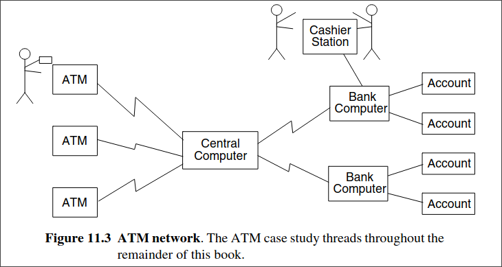

---
markmap:
  maxWidth: 500
  embedAssets: true
  expandlevel: 0
  initialExpandLevel: 0
---

# Interaction Modelling

- The interaction model is the third leg of the modeling tripod and describes interactions with- in a system. The class model describes the objects in a system and their relationships, the state model describes the life cycles of the objects, and the interaction model describes how the objects interact.  The interaction model describes how objects interact to produce useful results. It is a ho- listic view of behavior across many objects, whereas the state model is a reductionist view of behavior that examines each object individually. Both the state model and the interaction model are needed to describe behavior fully. They complement each other by viewing be- havior from two different perspectives.  Interactions can be modeled at different levels of abstraction. At a high level, use cases describe how a system interacts with outside actors. Each use case represents a piece of func- tionality that a system provides to its users. Use cases are helpful for capturing informal re- quirements.  Sequence diagrams provide more detail and show the messages exchanged among a set of objects over time. Messages include both asynchronous signals and procedure calls. Se- quence diagrams are good for showing the behavior sequences seen by users of a system.  And finally, activity diagrams provide further detail and show the flow of control among the steps of a computation. Activity diagrams can show data flows as well as control flows.  Activity diagrams document the steps necessary to implement an operation or a business process referenced in a sequence diagram.

## Use Case Models

### Actors
- An actor is a direct external user of a system—an object or set of objects that communicates directly with the system but that is not part of the system. Each actor represents those objects that behave in a particular way toward the system. 
 
For example, customer and repair techni- cian are different actors of a vending machine. For a travel agency system, actors might in- clude traveler, agent, and airline. For a computer database system, actors might include user and administrator. Actors can be persons, devices, and other systems—anything that inter- acts directly with the system.  An object can be bound to multiple actors if it has different facets to its behavior. For example, the objects Mary, Frank, and Paul may be customers of a vending machine. Paul may also be a repair technician for the vending machine.  An actor has a single well-defined purpose. In contrast, objects and classes often com- bine many different purposes. An actor represents a particular facet of objects in its interac- tion with a system. The same actor can represent objects of different classes that interact similarly toward a system. For example, even though many different individual persons use a vending machine, their behavior toward the vending machine can all be summarized by the actors customer and repair technician. Each actor represents a coherent set of capabilities for its objects.  Modeling the actors helps to define a system by identifying the objects within the system and those on its boundary. An actor is directly connected to the system—an indirectly con- nected object is not an actor and should not be included as part of the system model. Any interactions with an indirectly connected object must pass through the actors. For example, the dispatcher of repair technicians from a service bureau is not an actor of a vending ma- chine—only the repair technician interacts directly with the machine. If it is necessary to model the interactions among such indirect objects, then a model should be constructed of the environment itself as a larger system. For example, it might be useful to build a model of a repair service that includes dispatchers, repair technicians, and vending machines as actors, but that is a different model from the vending machine model.

### Use Case

- The various interactions of actors with a system are quantized into use cases. A use case is a coherent piece of functionality that a system can provide by interacting with actors. 

For example, a customer actor can buy a beverage from a vending machine. The customer inserts money into the machine, makes a selection, and ultimately receives a beverage. Similarly, a repair technician can perform scheduled maintenance on a vending machine. 

Figure 7.1 summarizes several use cases for a vending machine.  Each use case involves one or more actors as well as the system itself. The use case buy a beverage involves the customer actor and the use case perform scheduled maintenance in- volves the repair technician actor. In a telephone system, the use case make a call involves two actors, a caller and a receiver. The actors need not all be persons. The use case make a trade on an online stock broker involves a customer actor and a stock exchange actor. The stock broker system needs to communicate with both actors to execute a trade.  A use case involves a sequence of messages among the system and its actors. For exam- ple, in the buy a beverage use case, the customer first inserts a coin and the vending machine displays the amount deposited. This can be repeated several times. Then the customer pushes a button to indicate a selection; the vending machine dispenses the beverage and issues change, if necessary.  Some use cases have a fixed sequence of messages. More often, however, the message sequence may have some variations. For example, a customer can deposit a variable number of coins in the buy a beverage use case. Depending on the money inserted and the item se- lected, the machine may, or may not, return change. You can represent such variability by showing several examples of distinct behavior sequences. Typically you should first define a mainline behavior sequence, then define optional subsequences, repetitions, and other vari- ations.  Error conditions are also part of a use case. For example, if the customer selects a bev- erage whose supply is exhausted, the vending machine displays a warning message. Similar- ly, the vending transaction can be cancelled. For example, the customer can push the coin return on the vending machine at any time before a selection has been accepted; the machine returns the coins, and the behavior sequence for the use case is complete. From the user’s point of view, some kinds of behavior may be thought of as errors. The designer, however, should plan for all possible behavior sequences. From the system’s point of view, user errors or resource failures are just additional kinds of behavior that a robust system can accommo- date.  A use case brings together all of the behavior relevant to a slice of system functionality.  This includes normal mainline behavior, variations on normal behavior, exception condi- tions, error conditions, and cancellations of a request. 

Figure 7.2 explains the buy a beverage use case in detail. Grouping normal and abnormal behavior under a single use case helps to ensure that all the consequences of an interaction are considered together.  In a complete model, the use cases partition the functionality of the system. They should preferably all be at a comparable level of abstraction. For example, the use cases make tele- phone call and record voice mail message are at comparable levels. The use case set external speaker volume to high is too narrow. It would be better as set speaker volume (with the vol- ume level selection as part of the use case) or maybe even just set telephone parameters, under which we might group setting volume, display pad settings, setting the clock, and so on.

### Use Case Diagrams

- A system involves a set of use cases and a set of actors. Each use case represents a slice of the functionality the system provides. The set of use cases shows the complete functionality of the system at some level of detail. Similarly, each actor represents one kind of object for which the system can perform behavior. The set of actors represents the complete set of ob- jects that the system can serve. Objects accumulate behavior from all the systems with which they interact as actors.  
 
The UML has a graphical notation for summarizing use cases and Figure 7.3 shows an example.

A rectangle contains the use cases for a system with the actors listed on the outside.  The name of the system may be written near a side of the rectangle. A name within an ellipse denotes a use case. A “stick man” icon denotes an actor, with the name being placed below or adjacent to the icon. Solid lines connect use cases to participating actors.  In the figure, the actor Repair technician participates in two use cases, the others in one each. Multiple actors can participate in a use case, even though the example has only one actor per use case.

### Guidelines For Use Case Diagrams

- Use cases identify the functionality of a system and organize it according to the perspective of users. In contrast, traditional requirements lists can include functionality that is vague to users, as well as overlook supporting functionality, such as initialization and termination.  Use cases describe complete transactions and are therefore less likely to omit necessary steps. There is still a place for traditional requirements lists in describing global constraints and other nonlocalized functionality, such as mean time to failure and overall throughput, but you should capture most user interactions with use cases. The main purpose of a system is almost always found in the use cases, with requirements lists supplying additional implementation constraints. Here are some guidelines for constructing use case models.

-  **Ensure that actors are focused**
   -   Each actor should have a single, coherent purpose. If a real-world object embodies multiple purposes, capture them with separate actors. For example, the owner of a personal computer may install software, set up a database, and send email. These functions differ greatly in their impact on the computer system and the potential for system damage. They might be broken into three actors: system administrator, database administrator, and computer user. Remember that an actor is defined with respect to a system, not as a free-standing concept.
  
-  **Each use case must provide value to users**
   -   A use case should represent a complete transaction that provides value to users and should not be defined too narrowly. For ex- ample, dial a telephone number is not a good use case for a telephone system. It does not represent a complete transaction of value by itself; it is merely part of the use case make telephone call. The latter use case involves placing the call, talking, and terminating the call. By dealing with complete use cases, we focus on the purpose of the functionality provided by the system, rather than jumping into implementation decisions. The details come later. Often there is more than one way to implement desired functionality.
  
-  **Relate use cases and actors**
   -   Every use case should have at least one actor, and every actor should participate in at least one use case. A use case may involve several actors, and an actor may participate in several use cases.
  
-  **Remember that use cases are informal**
   -  It is important not to be obsessed by formal- ism in specifying use cases. They are not intended as a formal mechanism but as a way to identify and organize system functionality from a user-centered point of view. It is acceptable if use cases are a bit loose at first. Detail can come later as use cases are ex- panded and mapped into implementations.

-  **Use cases can be structured**
   -   For many applications, the individual use cases are com- pletely distinct. For large systems, use cases can be built out of smaller fragments using relationships (see Chapter 8).

## Sequence Modles

- A text format is convenient for writing, but it does not clearly show the sender and receiver of each message, especially if there are more than two objects. A sequence diagram shows the participants in an interaction and the sequence of messages among them. A sequence di- agram shows the interaction of a system with its actors to perform all or part of a use case.  

Figure 7.5 shows a sequence diagram corresponding to the previous stock broker sce- nario. Each actor as well as the system is represented by a vertical line called a lifeline and each message by a horizontal arrow from the sender to the receiver. Time proceeds from top to bottom, but the spacing is irrelevant; the diagram shows only the sequence of messages, not their exact timing. (Real-time systems impose time constraints on event sequences, but that requires extra notation.) Note that sequence diagrams can show concurrent signals— stock broker system sends messages to customer and securities exchange concurrently—and signals between participants need not alternate—stock broker system sends secure commu- nication followed by display portfolio.  Each use case requires one or more sequence diagrams to describe its behavior. Each se- quence diagram shows a particular behavior sequence of the use case. It is best to show a specific portion of a use case and not attempt to be too general. Although it is possible to show conditionals within a sequence diagram, usually it is clearer to prepare one sequence diagram for each major flow of control.  Sequence diagrams can show large-scale interactions, such as an entire session with the stock broker system, but often such interactions contain many independent tasks that can be combined in various ways. Rather than repeating information, you can draw a separate se- quence diagram for each task. For example, Figure 7.6 and Figure 7.7 show an order to pur- chase a stock and a request for a quote on a stock. 

These and various other tasks (not shown) would fit within an entire stock trading session.  You should also prepare a sequence diagram for each exception condition within the use case. For example, Figure 7.8 shows a variation in which the customer does not have suffi- cient funds to place the order. 

In this example, the customer cancels the order. In another variation (not shown), the customer would reduce the number of shares purchased and the order would be accepted.  In most systems, there are an unlimited number of scenarios, so it is not possible to show them all. However, you should try to elaborate all the use cases and cover the basic kinds of behavior with sequence diagrams. For example, a stock broker system can interleave pur- chases, sales, and inquiries arbitrarily. It is unnecessary to show all combinations of activities, once the basic pattern is established.

### Guidelines for Sequence Models

- The sequence model adds detail and elaborates the informal themes of use cases. There are two kinds of sequence models. Scenarios document a sequence of events with prose. Se- quence diagrams also document the sequence of events but more clearly show the actors in- volved. The following guidelines will help you with sequence models.

- Prepare at least one scenario per use case. 
  - The steps in the scenario should be logical commands, not individual button clicks. Later, during implementation, you can specify the exact syntax of input. Start with the simplest mainline interaction—no repetitions, one main activity, and typical values for all parameters. If there are substantially differ- ent mainline interactions, write a scenario for each.
 
- Abstract the scenarios into sequence diagrams. 
  - The sequence diagrams clearly show the contribution of each actor. It is important to separate the contribution of each actor as a prelude to organizing behavior about objects.
 
- Divide complex interactions. 
  - Break large interactions into their constituent tasks and prepare a sequence diagram for each of them.
 
- Prepare a sequence diagram for each error condition. 
  - Show the system response to the error condition.

## Activity Modles

- An activity diagram shows the sequence of steps that make up a complex process, such as an algorithm or workflow. An activity diagram shows flow of control, similar to a sequence diagram, but focuses on operations rather than on objects. Activity diagrams are most useful during the early stages of designing algorithms and workflows.  

Figure 7.9 shows an activity diagram for the processing of a stock trade order that has been received by an online stock broker. The elongated ovals show activities and the arrows show their sequencing. The diamond shows a decision point and the heavy bar shows split- ting or merging of concurrent threads.  The online stock broker first verifies the order against the customer’s account, then ex- ecutes it with the stock exchange. If the order executes successfully, the system does three things concurrently: mails trade confirmation to the customer, updates the online portfolio to reflect the results of the trade, and settles the trade with the other party by debiting the ac- count and transferring cash or securities. When all three concurrent threads have been com- pleted, the system merges control into a single thread and closes the order. If the order execution fails, then the system sends a failure notice to the customer and closes the order.  An activity diagram is like a traditional flowchart in that it shows the flow of control from step to step. Unlike a traditional flowchart, however, an activity diagram can show both sequential and concurrent flow of control. This distinction is important for a distributed sys- tem. Activity diagrams are often used for modeling human organizations because they in- volve many objects—persons and organizational units—that perform operations concurrently.

### Activities

- The steps of an activity diagram are operations, specifically activities from the state model.  The purpose of an activity diagram is to show the steps within a complex process and the sequencing constraints among them.  Some activities run forever until an outside event interrupts them, but most activities eventually complete their work and terminate by themselves. The completion of an activity is a completion event and usually indicates that the next activity can be started. An unlabeled arrow from one activity to another in an activity diagram indicates that the first activity must complete before the second activity can begin.  An activity may be decomposed into finer activities. 

For example, 

Figure 7.10 expands the execute order activity of Figure 7.9. It is important that the activities on a diagram be at the same level of detail. For example, in Figure 7.9 execute order and settle trade are similar in detail; they both express a high-level operation without showing the underlying mecha- nisms. If one of these activities were replaced in the activity diagram by its more detailed steps, the other activities should be replaced as well to maintain balance. Alternatively, bal- ance can be preserved by elaborating the activities in separate diagrams.

### Branches

- If there is more than one successor to an activity, each arrow may be labeled with a condition in square brackets, for example, [failure]. All subsequent conditions are tested when an ac- tivity completes. If one condition is satisfied, its arrow indicates the next activity to perform.  If no condition is satisfied, the diagram is badly formed and the system will hang unless it is interrupted at some higher level. To avoid this danger, you can use the else condition; it is satisfied in case no other condition is satisfied. If multiple conditions are satisfied, only one successor activity executes, but there is no guarantee which one it will be. Sometimes this kind of nondeterminism is desirable, but often it indicates an error, so the modeler should determine whether any overlap of conditions can occur and whether it is correct.  As a notational convenience, a diamond shows a branch into multiple successors, but it means the same thing as arrows leaving an activity symbol directly. In Figure 7.9 the dia- mond has one incoming arrow and two outgoing arrows, each with a condition. A particular execution chooses only one path of control.  If several arrows enter an activity, the alternate execution paths merge. Alternatively, several arrows may enter a diamond and one may exit to indicate a merge.

### Initiation and Termination

- A solid circle with an outgoing arrow shows the starting point of an activity diagram. When an activity diagram is activated, control starts at the solid circle and proceeds via the outgoing arrow toward the first activities. A bull’s-eye (a solid circle surrounded by a hollow circle) shows the termination point—this symbol only has incoming arrows. When control reaches a bull’s-eye, the overall activity is complete and execution of the activity diagram ends.

### Concurrent Activites

- Unlike traditional flow charts, organizations and computer systems can perform more than one activity at a time. The pace of activity can also change over time. For example, one ac- tivity may be followed by another activity (sequential control), then split into several con- current activities (a fork of control), and finally be combined into a single activity (a merge of control). A fork or merge is shown by a synchronization bar—a heavy line with one or more input arrows and one or more output arrows. On a synchronization, control must be present on all of the incoming activities, and control passes to all of the outgoing activities.  

Figure 7.9 illustrates both a fork and merge of control. Once an order is executed, there is a fork—several tasks need to occur and they can occur in any order. The stock trade system must send confirmation to the customer, debit the customer’s account, and update the cus- tomer’s online portfolio. After the three concurrent tasks complete and the trade is settled, there is a merge, and execution proceeds to the activity of closing the order.

### Executable Activity Diagrams

- Activity diagrams are not only useful for defining the steps in a complex process, but they can also be used to show the progression of control during execution. An activity token can be placed on an activity symbol to indicate that it is executing. When an activity completes, the token is removed and placed on the outgoing arrow. In the simplest case, the token then moves to the next activity.  If there are multiple outgoing arrows with conditions, the conditions are examined to de- termine the successor activity. Only one successor activity can receive the token, even if more than one condition is true. If no condition is satisfied, the activity diagram is ill formed.  Multiple tokens can arise through concurrency. If an executing activity is followed by a concurrent split of control, completion causes an increase in the number of tokens—a token is placed on each of the concurrent activities. Similarly, a merge of control causes a decrease in the number of tokens as tokens migrate from the input activities to the output activities.  All the input activities must complete before the merge can actually occur.

### Guidelines for Activity Diagrams

- Activity diagrams elaborate the details of computation, thus documenting the steps needed to implement an operation or a business process. In addition, activity diagrams can help de- velopers understand complex computations by graphically displaying the progression through intermediate execution steps. Here is some advice for activity models.

- Don’t misuse activity diagrams. 
  - Activity diagrams are intended to elaborate use case and sequence models so that a developer can study algorithms and workflow. Activity diagrams supplement the object-oriented focus of UML models and should not be used as an excuse to develop software via flowcharts.
 
- Level diagrams. 
  - Activities on a diagram should be at a consistent level of detail. Place additional detail for an activity in a separate diagram.
 
- Be careful with branches and conditions. 
  - If there are conditions, at least one must be satisfied when an activity completes—consider using an else condition. In undetermin- istic models, it is possible for multiple conditions to be satisfied—otherwise this is an error condition.
 
- Be careful with concurrent activities. 
  - Concurrency means that the activities can com- plete in any order and still yield an acceptable result. Before a merge can happen, all inputs must first complete.
 
- Consider executable activity diagrams. 
  - Executable activity diagrams can help devel- opers understand their systems better. Sometimes they can even be helpful for end users who want to follow the progression of a process.

## The ATM Case Study

Figure 11.1 lists our original system concept for an Automated Teller Machine (ATM). We ask high-level questions to elaborate the initial concept.

- Who is the application for? 
  - A number of companies provide ATM products. Conse- quently, only a vendor or a large financial company could possibly justify the cost and effort of building ATM software.  A vendor would be competing for customers in an established market. A large ven- dor could certainly enter such a market, but might find it advantageous to partner with or acquire an existing supplier. A small vendor would need some special feature to dif- ferentiate itself from the crowd and attract attention.  It is unlikely that a financial company could justify developing ATM software just for its own use, because it would probably be more expensive than purchasing a product.  If a financial company wanted special features, it could partner with a vendor. Or it might decide to create a separate organization that would build the software, sell it to the sponsoring company, and then market it to others.For the ATM case study, we will assume that we are a vendor building the software.  We will assume that we are developing an ordinary product, since deep complexities of the ATM problem domain are beyond the scope of this book.

- What problems will it solve? 
  - The ATM software is intended to serve both the bank and the customer. For the bank, ATM software increases automation and reduces manual handling of routine paperwork. For the customer, the ATM is ubiquitous and always available, handling routine transactions whenever and wherever the customer desires.  ATM software must be easy to use and convenient so that customers will use it in pref- erence to bank tellers. It must be reliable and secure since it will be handling money.
 
- Where will it be used? 
  - ATM software has become essential to financial institutions.  Customers take it for granted that a bank will have an ATM machine. ATM machines are available at many stores, sporting events, and other locations throughout the world.
 
- When is it needed? 
  - Any software development effort is a financial proposition. The in- vestment in development ultimately leads to a revenue stream. From an economic per- spective, it is desirable to minimize the investment, maximize the revenue, and realize revenue as soon as possible. Thoughtful modeling and OO techniques are conducive to this goal.
 
- Why is it needed? 
  - There are many reasons why a vendor might decide to build a soft- ware product. If other companies are making money with similar products, there is an economic incentive to participate. A novel product could outflank competitors and lead to premium pricing. Businesses commission internal efforts for technology that is diffi- cult to buy and critical to them. We have no real motivation to develop ATM software, other than to demonstrate the techniques in this book.
 
- How will it work? 
  - We will adopt a three-tier architecture to separate the user interface from programming logic, and programming logic from the database. In reality, the ar- chitecture is n-tier, because there can be any number of intermediate programming lev- els communicating with each other. We will discuss architecture further in the System Design chapter.

### The ATM Case Study

Figure 11.3 shows a problem statement for an automated teller machine (ATM) network.

- Design the software to support a computerized banking network including both human cash- iers and automatic teller machines (ATMs) to be shared by a consortium of banks. Each bank provides its own computer to maintain its own accounts and process transactions against them. Cashier stations are owned by individual banks and communicate directly with their own bank’s computers. Human cashiers enter account and transaction data.  Automatic teller machines communicate with a central computer that clears transac- tions with the appropriate banks. An automatic teller machine accepts a cash card, interacts with the user, communicates with the central system to carry out the transaction, dispenses cash, and prints receipts. The system requires appropriate recordkeeping and security provi- sions. The system must handle concurrent accesses to the same account correctly.  The banks will provide their own software for their own computers; you are to design the software for the ATMs and the network. The cost of the shared system will be appor- tioned to the banks according to the number of customers with cash cards.